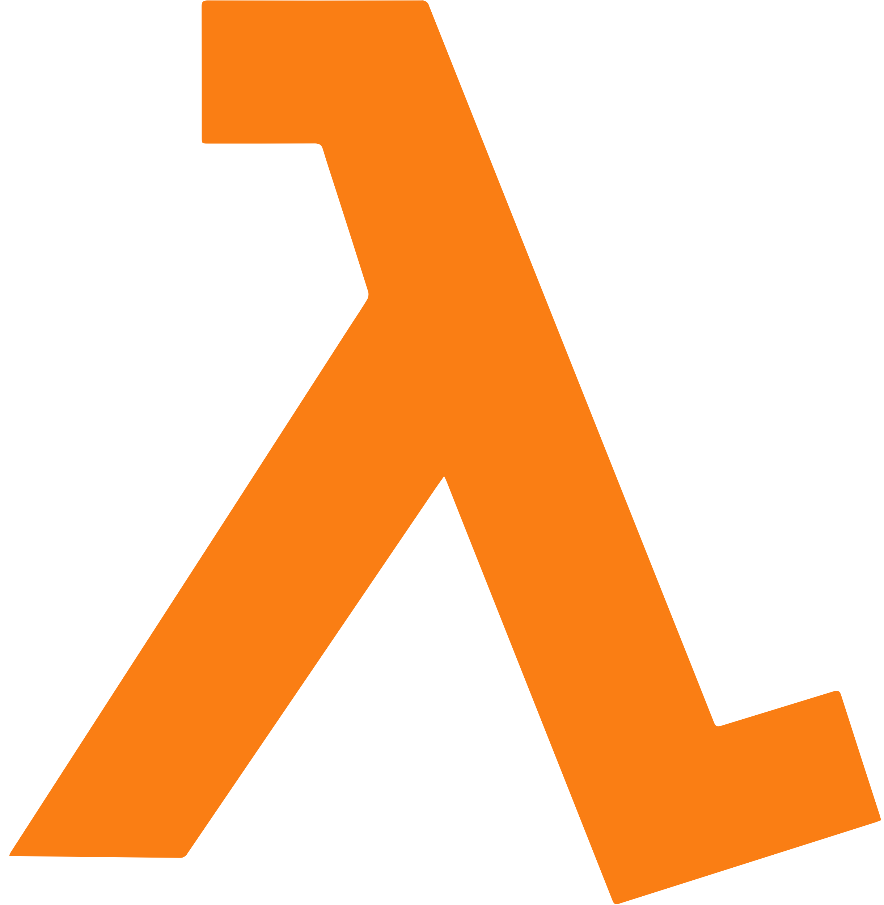

# ORDER + PAYMENT

<!-- markdownlint-disable MD033-->
<center>
<div>





</div>
</center>


## Project

The aim of this project is create an architecture with two microservices in 4 lambda functions that will be triggered by an api gateway and by sqs events. The microservices were be written in `Go` language and the architecture was built in AWS.

## Deployment

To  deploy this project you should have installed [Terraform](https://developer.hashicorp.com/terraform/tutorials/aws-get-started/install-cli) in your local machine and an account of AWS.

When you have installed Terraform move to the root of this project run the followings commands

``` sh
terraform init
terraform apply
```

Type `yes` to apply the configuration and when it finished it will print the url to make the requests

## Specifications

### Architecture

#### Whole Architecture

The whole architecture for this project is described in the next image.


Each microservice was developed following the clean architecture design philosophy to make it scalable, maintainable and easy to understand.

### Testing

The tests were written using `testify` library. The test contemplate different cases and for this propose whe mock almost all  dependencies.

### Pattern design

For this project was used the pattern design `Dependency Injection` in order to make easy maintain the application and develop  tests.

### Terraform

Terraform was used in this project to create the cloud architecture and deploy id easily with a single command. Were created modules to organize the structure for each microservice.

## Testing the application

When you run the commands explained previously you will have the whole architecture deployed and a link to make the requests.

### Endpoints

There are two endpoints, one to create and order and other to make a payment and complete the order.

#### /order

this end point receive a `POST` request with this body

```json
{
    "user_id":string,
    "item":string,
    "quantity":int,
    "total_price":int
}
```

this request will create the order in a dynamo table named `orders`, it will create the event listened by the payment and that service will create the payment row in `payments` table. And finally the microservice will return the order_id.

### /payment

This endpoint will receive also a `POST` request with the next body

```json
    {
        "oder_id":string,
        "status":string
    }
```

this request will change the status in the `payments` table and will send and event that will be listened by the orders service and that service will update the order status to `shipping`.

## Missing

 Develop the test for the whole application. The test made were just for illustrative examples of how we can test our functions that has dependencies, and how mock them. 
